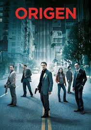

<!-- ESTO ES UNA RESEÑA DE LA PELICULA ORIGEN DE Christopher Nolan -->
# &#127916; Reseña de Película: *Origen* (Inception)
---
¡Bienvenido/a al laberinto de la mente! &#129327; 
Este documento es una **inmersión** profunda en *Origen* (2010), el thriller de ciencia ficción dirigido por *Christopher Nolan* que redefinió lo que era posible en el cine.  
Abróchate el cinturón, porque la realidad es *relativa*. 



---
<!-- INDICE DE LA RESEÑA CON SUS DIFERENTES APARTADOS -->
 ## Índice 
* [Sinopsis: ¿Qué es la idea más resistente?](#sinopsis-qué-es-la-idea-más-resistente)
* [Ficha Técnica y Reparto de élite](#ficha-técnica-y-reparto-de-élite)
* [Las Reglas del Mundo de los Sueños](#las-reglas-del-mundo-de-los-sueños)
* [Análisis y Temas Profundos](#análisis-y-temas-profundos)
* [Código: La Arquitectura de un Sueño](#código-la-arquitectura-de-un-sueño)
* [Recursos y Referencias](#recursos-y-referencias)

---

<!-- SINOPSIS DE LA PELICULA -->
## Sinopsis: ¿Qué es la idea más resistente?
[ &#128316; Volver al Índice](#índice)

Dom Cobb es un ***ladrón experto***, el mejor en el peligroso arte de la *extracción*: robar secretos valiosos desde las profundidades del subconsciente durante el sueño.  
Esta habilidad lo ha convertido en un fugitivo internacional y le ha costado todo lo que ama.  

Ahora, a Cobb se le ofrece una última oportunidad para redimirse, pero en lugar de robar una idea, su equipo debe hacer lo imposible: **implantar una**. 💭

---
<!-- TABLA SOBRE LOS ACTORES PRINCIAPLES, DIRECTOR Y AÑO DE LANZAMIENTO -->
## Ficha Técnica y Reparto de élite
[&#128316; Volver al Índice](#índice)


| Elemento | Detalle | Rol |
|:--|:--:|:--:
| **Director** | Christopher Nolan | Director
| **Año** | 2010 | Año de lanzamiento | 
| **Reparto** | Leonardo DiCaprio, Ellen Page, Joseph Gordon-Levitt | Actores

 

---
<!-- EXPLICACION DE LAS REGLAS DE LOS SUEÑOS EN LA PELICULA -->
## Las Reglas del Mundo de los Sueños
[ &#128316; Volver al Índice](#índice)

En *Origen*, los sueños se estructuran como **capas de realidad**. Cada nivel de sueño transcurre a una velocidad distinta, una proporción que podríamos expresar así:

> Tiempo en el sueño = Tiempo real × 10<sup>n</sup>

Donde *n* representa el **nivel de profundidad** en el subconsciente.  
Por ejemplo, si una hora en la realidad equivale a 10 horas en el primer nivel, en el tercer nivel serían 10<sup>3</sup> = 1000 horas.  
Una distorsión temporal que convierte segundos reales en eternidades oníricas ⏳.  

Además, la mente de cada soñador puede **reaccionar como un sistema de defensa** ante los intrusos.  
Podríamos representarlo simbólicamente como:

> Defensa mental = Intuición<sub>consciente</sub> + Miedo<sub>inconsciente</sub>

De esta forma, el subíndice indica cómo el *inconsciente* y el *consciente* actúan en diferentes niveles del sueño.

### Reglas principales de los sueños:
1. Cada nivel tiene su **propia velocidad temporal**.
2. Cuanto más profundo se va:
   - Mayor es la **inestabilidad** del entorno.
   - El subconsciente del soñador puede crear **defensas físicas y obstáculos**.
3. Se pueden crear **sueños dentro de sueños**:
   - Nivel 1: Ciudad — control parcial del entorno.  
   - Nivel 2: Hotel — mayor complejidad y riesgos.  
   - Nivel 3: Fortaleza — control limitado, máxima vulnerabilidad.

4. **El tiempo es relativo**:
   - Un minuto en la realidad puede equivaler a horas en el sueño.  
   - Este desfase permite planear operaciones complejas sin riesgo inmediato en el mundo real.


---
<!-- UN ANALISIS PROFUNDO SOBRE EL TEMA DE LA PELICULA -->
## Análisis y Temas Profundos
[&#128316; Volver al Índice](#índice)

Nolan juega con ideas de *culpa, redención y realidad*.  
El uso de la arquitectura de sueños representa cómo la mente humana **construye su propia prisión**.  

> “No debemos confundir ~~los recuerdos~~ con ~~la realidad~~.”

El concepto de **implantar una idea** plantea una reflexión filosófica: ¿cuánto de lo que creemos *propio* es realmente nuestro?  
Incluso la famosa ecuación de Einstein, *E = mc<sup>2</sup>*, sirve aquí como metáfora de cómo una *idea* (energía mental) puede transformarse en una *acción real* (masa simbólica).

---
<!-- UN PEQUEÑO BLOQUE DE CODIGO DE PYTHON CON LA FORMULA PARA CALCULAR LOS NIVELES DE LOS SUEÑOS -->
## Código: La Arquitectura de un Sueño
[&#128316; Volver al Índice](#índice)

En *Origen*, los sueños se construyen como niveles jerárquicos que deben estar **sincronizados** para que la misión tenga éxito.  
Podemos simular un cálculo de los tiempos en Python:

```python
# Simulación de niveles de sueño
niveles = [1, 2, 3]
tiempo_real = 1  # 1 hora real

for n in niveles:
    tiempo_sueño = tiempo_real * (10 ** n)
    print(f"Nivel {n}: {tiempo_sueño} horas por cada hora real")
```

---

<!-- ENLACES SOBRE LA PAGINA OFICIAL DE LA PELICULA Y Y NOLAN -->

## Recursos y Referencias
[&#128316; Volver al Índice](#índice)

- [Página oficial de Inception](https://www.warnerbros.com/movies/inception)
- [Christopher Nolan en Wikipedia](https://es.wikipedia.org/wiki/Christopher_Nolan)

### Notas al pie
1. Nolan explora la complejidad de la mente humana a través de capas de sueños[^1].
2. La ecuación E = mc<sup>2</sup> sirve como analogía de cómo las ideas se transforman en acciones[^2].

[^1]: Christopher Nolan, director de *Interstellar* y *The Dark Knight*.  
[^2]: Einstein, Albert. *Teoría de la relatividad*.
